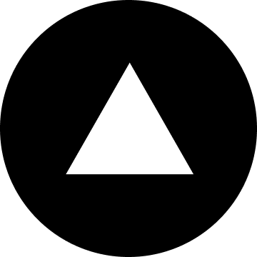
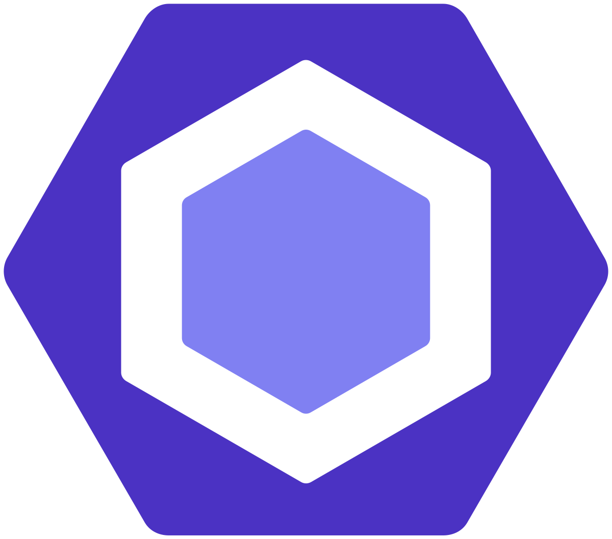
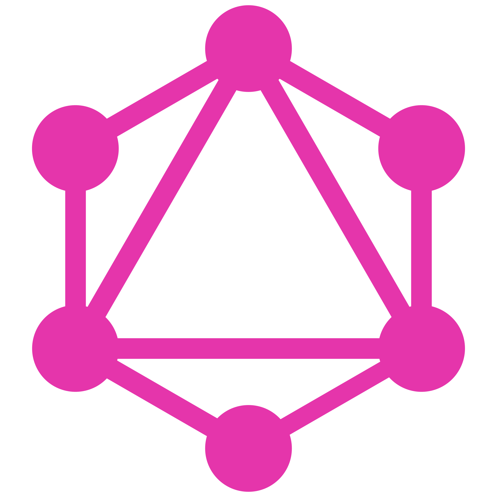

    

<a href="frylo.org">
  

<!-- https://readme-typing-svg.demolab.com/demo/ -->

<h1 align="center">
    
</h1>

</a>

 

  <h3 align="center">
    Hi there, I'm <a href="frylo.org" target="_blank" rel="noreferrer">Frylo</a> 👋
  </h3>

  <h2 align="center">
    I'm a Frontend Developer 💻!
  </h2>

  <h5 align="center"> <code> <a href="https://frylo.org" title="Website">  frylo.org </a> </code> &nbsp; <code> <a href="frylo.d.ts@gmail.com" title="GMail Account">  Gmail </a> </code> &nbsp; <code> <a href="https://www.linkedin.com/in/frylo/" title="LinkedIn Profile">  LinkedIn </a> </code> &nbsp; <code> <a href="https://www.youtube.com/@frylo0" title="YouTube Channel">  YouTube </a> </code> &nbsp; <code> <a href="https://gitlab.com/frylo" title="GitLab Profile">  GitLab </a> </code> &nbsp; <code> <a href="https://github.com/frylo0" title="GitHub Profile">  GutHub </a> </code> </h5>

 
 
 
 
 

<h2 align="center">🔭 I'm currently working on</h2>

  My personal 
<code>&nbsp;GSAP</code>&nbsp;
 website with blog
   
  Improving my 
<code>&nbsp;DevOps</code>&nbsp;
 skills
   
  Studying 
<code>&nbsp;Arduino UNO</code>&nbsp;
 Micro-controller

 
 
 

<h2 align="center">🌱 I'm currently learning</h2>

  1) 
<code>&nbsp;React</code>&nbsp;
 Native
   
  2) 
<code>&nbsp;GSAP</code>&nbsp;
 Library for SVG animations
   
  3) 
<code>&nbsp;Docker</code>&nbsp;
 Containers

 
 
 

<h2 align="center">🔥 Languages & Frameworks & Tools & Abilities 🔥</h2>
 

 <code>&nbsp;React</code>&nbsp; <code>&nbsp;Redux</code>&nbsp; <code>&nbsp;NPM</code>&nbsp; <code>&nbsp;VS Code</code>&nbsp; <code>&nbsp;Visual Studio</code>&nbsp; <code>&nbsp;Gitlab CI</code>&nbsp; <code>&nbsp;StackOverflow</code>&nbsp; <code>&nbsp;PostgreSQL</code>&nbsp; <code>&nbsp;Problem Solving</code>&nbsp; <code>&nbsp;Python</code>&nbsp; <code>&nbsp;CSS</code>&nbsp; <code>&nbsp;HTML</code>&nbsp; <code>&nbsp;jQuery</code>&nbsp; <code>&nbsp;PHP</code>&nbsp; <code>&nbsp;Unity 3D</code>&nbsp; <code>&nbsp;JSON</code>&nbsp; <code>&nbsp;C</code>&nbsp; <code>&nbsp;C++</code>&nbsp; <code>&nbsp;C#</code>&nbsp; <code>&nbsp;Git</code>&nbsp; <code>&nbsp;Gulp</code>&nbsp; <code>&nbsp;JavaScript</code>&nbsp; <code>&nbsp;Sass/Scss</code>&nbsp; <code>&nbsp;Vercel</code>&nbsp; <code>&nbsp;Webpack</code>&nbsp; <code>&nbsp;WebSocket</code>&nbsp; <code>&nbsp;Jira</code>&nbsp; <code>&nbsp;Confluence</code>&nbsp; <code>&nbsp;Markdown</code>&nbsp; <code>&nbsp;Stylus</code>&nbsp; <code>&nbsp;Vanilla-extract/CSS</code>&nbsp; <code>&nbsp;Next.js</code>&nbsp; <code>&nbsp;Yii2</code>&nbsp; <code>&nbsp;Google Sheets</code>&nbsp; <code>&nbsp;Jest</code>&nbsp; <code>&nbsp;Eslint</code>&nbsp; <code>&nbsp;Prettier</code>&nbsp; <code>&nbsp;StyleLint</code>&nbsp; <code>&nbsp;Husky</code>&nbsp; <code>&nbsp;BrowsersList</code>&nbsp; <code>&nbsp;Zustand</code>&nbsp; <code>&nbsp;Yarn</code>&nbsp; <code>&nbsp;PNPM</code>&nbsp; <code>&nbsp;Docker</code>&nbsp; <code>&nbsp;Styled Components</code>&nbsp; <code>&nbsp;Typescript</code>&nbsp; <code>&nbsp;Bootstrap</code>&nbsp; <code>&nbsp;MUI</code>&nbsp; <code>&nbsp;Backbone.js</code>&nbsp; <code>&nbsp;Vue.js</code>&nbsp; <code>&nbsp;Svelte</code>&nbsp; <code>&nbsp;WordPress</code>&nbsp; <code>&nbsp;MySQL</code>&nbsp; <code>&nbsp;JWT</code>&nbsp; <code>&nbsp;REST API</code>&nbsp; <code>&nbsp;GraphQL</code>&nbsp; <code>&nbsp;Linux</code>&nbsp; 

 
 
 

<h2 align="center">⚡ Stats ⚡</h2>

 

    

    
    
    

 
 
 

<h2 align="center">👨‍💻 Repositories 👨‍💻</h2>

            

<h4 align="center">
  <a href="https://github.com/frylo0?tab=repositories" title="Show Repositories">🔎 Show More 🔍</a>
</h4>